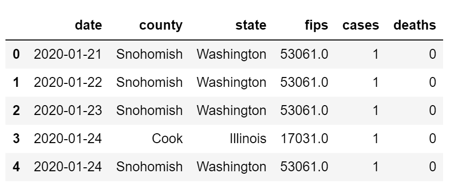
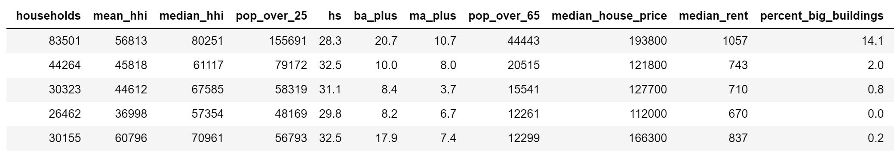
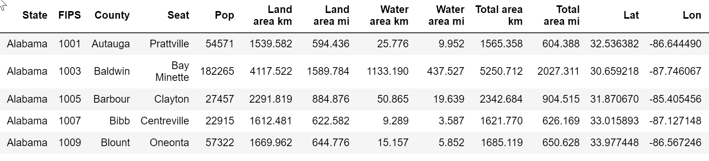
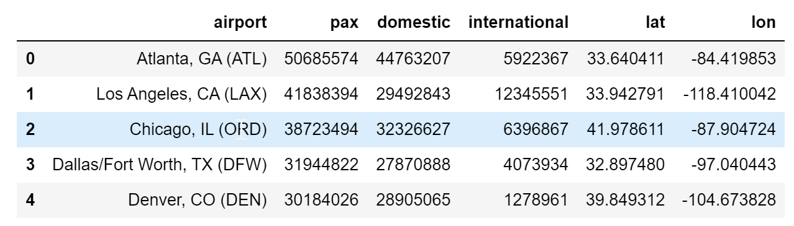
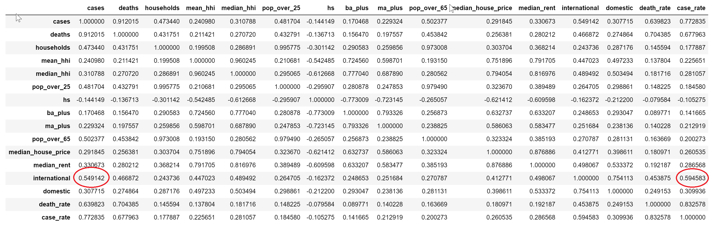
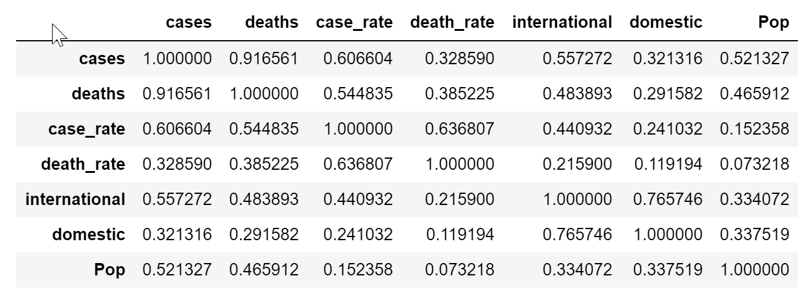
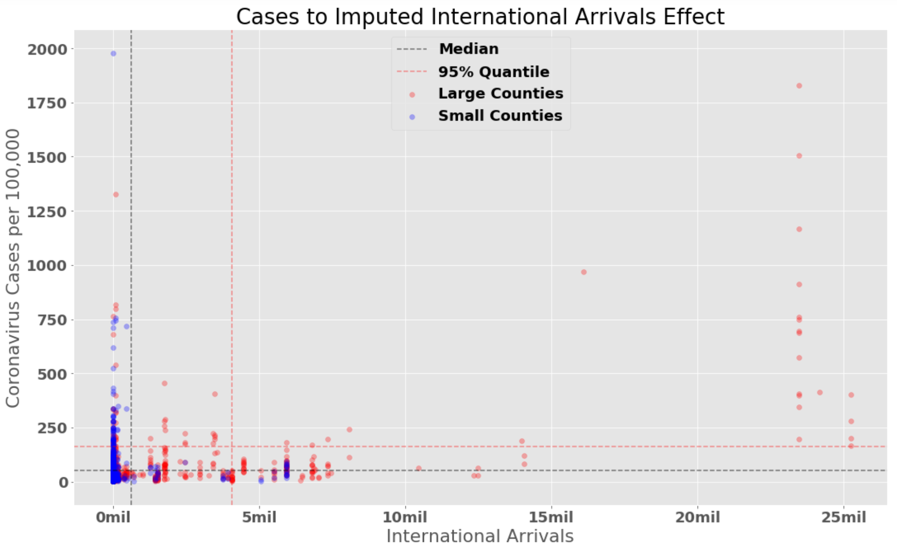
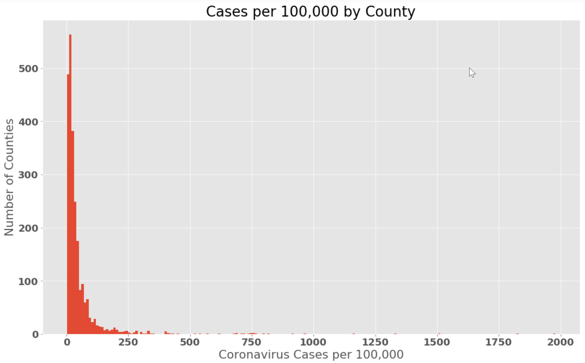
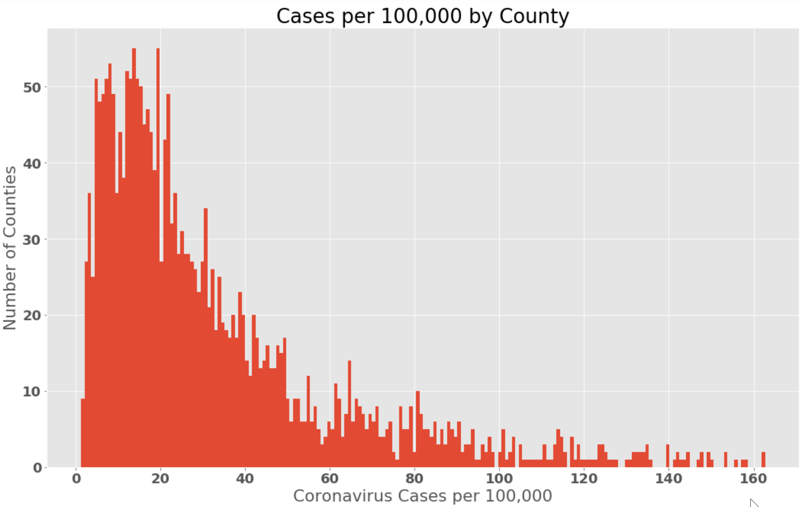
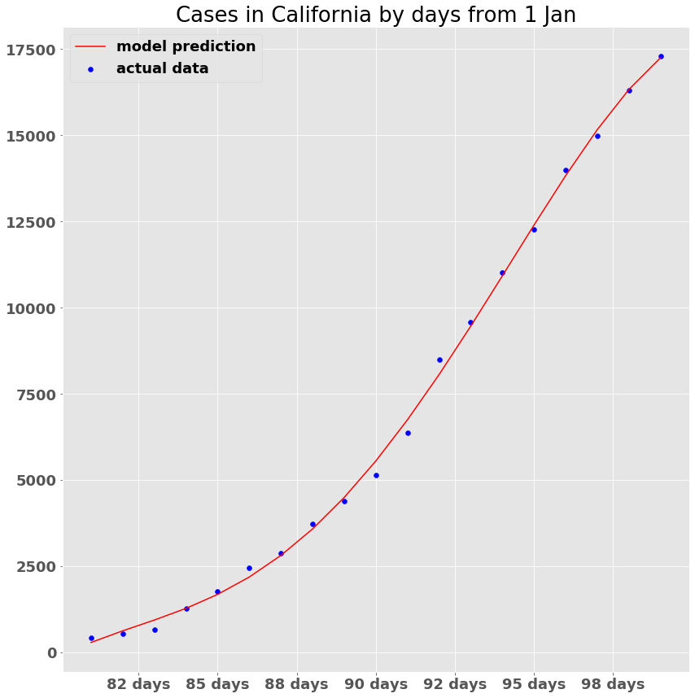

<!--image from CDC's web page -->
# Characteristics of Coronavirus Hotspots
Ian Branum -- *10 April 2020*

## Table of Contents

- [Executive Summary](#executive-summary)
- [Introduction](#introduction)
- [Data Sources](#data-sources)
- [Data Exploration](#data-exploration)
- [Hypothesis](#hypothesis)
- [Results](#results)
- [Next Steps](#next-steps)
 

## Executive Summary

## Introduction
Coronavirus is understandably on everyone's mind. Organizations from the CDC, to CNN, to the New York Times publish charts showing exponential growth rates and maps showing an uneven distribution of cases across the United States. In aggregate the message is terrifying. My intention with this study, and the ones to follow, is to zoom in on the details, to examine the spread of the virus at a more localized level. In this study I will examine the uneven distribution of cases across the United States by county. Some counties have proportionally more cases than others: what characteristics distinguish the harder hit counties from those less hard hit? I will make no assertions as to causation at this point, merely as to correlation. 

## Data Sources
With this study I intend to identify the demographic characteristics that correlate to higher or lower case rates. To that end, I collected from a variety of sources as follows. 

### New York Times Coronavirus Data
The core data source for this study is the [New York Times Coronavirus](https://github.com/nytimes/covid-19-data) Github page. This page contains a listing of every case in the United States by date and county. This was the core data set to which everything else was linked. Table 1 shows the structure of the data set. As of 8 April 2020 there are 37,636 entries for 2477 distinct counties. 

> Table 1 - NYT Coronavirus Github Page
>

### Census Data
I pulled the bulk of the demographic data from the [Census.gov](https://data.census.gov/cedsci/) Advanced Search tool. This tool was release the first of April, replacing the previous one. Unfortunately, it seems to be buggy and has subsequently been taken down. The tool was designed to provide fused results from across their various data sets, but the fusing functionality was balky. I thus ended up pulling four separate extracts and fusing them together locally. Another shortcoming is that it is only returning reports on 840 counties. This is disappointing as it represents only one-quarter of the counties in the United States, but it is sufficiently large to still be worth exploring. Table 2 shows the subset of the columns extracted and fused actually used in exploration. 

> Table 2 - Fused Census data
>

### Counties Data
For counties I needed the name, state, population, and lat/lon of the center. Fortunately, I found a [Table of United States Counties](https://en.wikipedia.org/wiki/User:Michael_J/County_table) on Wikipedia. The provenance is not great, but I spot checked it and it seems solid. It has entries for 3,143 counties in the United States. Table 3 shows the columns available. 

> Table 3 - Counties List
>

### Airports Data
Finally, as one potential hypothesis related to the effects of international arrivals on case rates, I need airport data. This was painful. I wanted both the lat/lon of the airport and the number of incoming international arrivals. I was forced to fuse two data sets, one a list of the [Top 100 US Airports](http://www.fi-aeroweb.com/Top-100-US-Airports.html) in 2017 by passenger arrivals and one from [ourairports.com](https://ourairports.com/data/airports.csv), which is an extract from the ICAO data set containing lat/lon of each airport. I would have preferred to pull directly from ICAO, but they wanted money. I fused the two together for the top 65 international airports in the United States, all those that receive more than 10,000 international arrivals per year, Table 4 shows the result. 

> Table 4 - Top Airports List
>

### Airport Arrivals Features
Using the counties data and the airports data, I created two features: imputed international arrivals and imputed domestic arrivals. In short, if an airport was within 100km of the center of a county, the annual arrivals, domestic and international, were assumed to impact that county. A simplistic algorithm, but sufficient for a start. 

## Data Exploration
Having fused the data into one giant Pandas dataframe, I created a correlation table based upon the dataframe. Table 5 is the result. 

> Table 5 - Correlation Matrix
>

Honestly, I was disappointed by the general lack of correlations. Many of the variables are clearly not independent and traveling in a pack. After controlling for their lack of independence, something may leap out, but one that did leap out is the correlation of proximity to an international airport (circled in red in Table 5). The proximity calculator was pretty basic so I shelved everything else to pursue this feature. 

Focusing in on the air-travel related features, I chopped the dataframe down and re-created the correlation table, as shown in Table 6. 

> Table 6 - Airport Arrivals Correlation Matrix
>

Two interesting observations become clearer absent chaff. First, while population is an adequate indicator for cases (r2 = 0.52) it is a poor indicator for case rate (r2 = 0.15). This is, I would think, counter-intuitive. The mean population of a county is only 118k so a city of any size is going to be in a larger county. Intuition is that an infectious disease will spread faster the larger the denser the population, but the r2 of 0.15 belies that. Curious.

The second interesting observation is the r2 of 0.44 when correlating to case rate. Plotting imputed international arrivals to case rate, I got Chart 1. 

> Chart 1 - International Arrivals vs Case Rate
>

Note that the top 25 counties are concentrated in three metro areas: New York City/New Jersey, Miami, and Los Angeles. Essentially, these 25 counties are all within 100 kilometers of JFK, MIA, or LAX. These three airports have 16m, 12m, and 10m international arrivals respectively, dominating international arrivals to the United State. The arbitrary 100km threshold can perhaps be improved upon. I adjusted the feature calculation to impute the full weight of the international arrivals out to Xkm and then taper linearly to zero at Ykm. This spread things out a bit, as seen on Chart 2. 

> Chart 2 - International Arrivals vs Case Rate (X=30, Y=200)
>

The top 19 counties are all still in NY/NJ. Given the density of airports and small counties in that part of the country this is likely appropriate. I decided to use the new feature formula with X=30 and Y=200. The logic here is that there is no difference between being 2 miles and 20 miles from a major airport and that over 130 its relevance dwindles to zero. 

It is worth noting that this is a highly skewed data set with a long right tail, as seen in Chart 3. 

> Chart 3 - Cases per 100,000 by County
>

Even if I declare the top 5% to be outliers and chop them off, the distribution remains highly skewed and non-normal, as can be seen in Chart 4. 

> Chart 4 - Cases per 100,000 by County, Excluding Top 5%
>

## Hypothesis
My hypothesis is that proximity to large international airports is a strong indicator for Coronavirus cases. More formally, scoring greater than x on the international arrivals feature calculation tend to have more Coronavirus cases than the rest. There is no obvious cut line for x so I decided to try 5m and 10m. 

### x=5m Hypothesis
> Null hypothesis: Counties scoring over 5m on the international arrivals feature calculation have the same Coronavirus rate per 100,000 as counties that score lower. 

For such a value of x, the two samples look like this:
>Sample 1: mean=173.9, std=303.5, se=29.8, count=104   
>Sample 2: mean=44.5, std=85.0, se=1.8, count=2,308

### x=10m Hypothesis
> Null hypothesis: Counties scoring over 10m on the international arrivals feature calculation have the same Coronavirus rate per 100,000 as counties that score lower. 

For such a value of x, the two samples look like this:
>Sample 1: mean=508.3, std=467.5, se=91.7, count=26  
>Sample 2: mean=45.1, std=84.0, se=1.7, count=2,386

### Ignore Counties Influenced by JFK, MIA, and LAX
> Null hypothsis: Removing the top 33 counties, the ones most strongly influenced by JFK, MIA, and LAX, amongst the remaining counties, counties scoring over 5m on the international arrivals feature calculation have the same Coronavirus rate per 100,000 as counties that score lower.

> Sample 1: mean=61.8, std=37.0, se=4.0, count=84
> Sample 2: mean=43.4, std=84.1, se=1.8, count=2,287

As the population is clearly not normally distributed, I opted for the Mann-Whitney U-test to test the two hypotheses. 

## Results
All three Mann-Whitney tests yielded microscopic p-values as follows:
> x=10m: p-value=2.20e-20

> x=5m: p-value=1.18e-20

> x=4m (less top 33 counties): p-value=1.63e-15

In all three cases I must reject the null hypothesis and embrace the observation that counties in close proximity to international airports have a higher Coronavirus case rate per 100,000 than those not. Likely the feature that I developed is deeply confounded with other variables, but there is nonetheless a strong correlation.  

## Next Steps
While the above analysis is interesting, it addresses only current Coronavirus cases per 100,000, not the growth rate. The next step will be to anlyze what factors influence the spread of Coronavirus. An initial attempt at polynomial regression suggests that the growth rate is easily modeled after the fact (See Chart 5) -- can we also predict its growth rate in the future?

> Chart 5 - 4 Degree Polynomial fitted to CA cases
>

